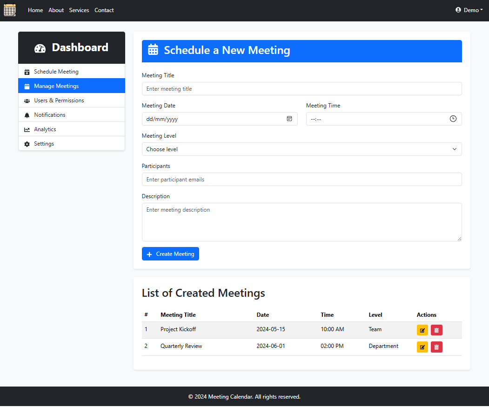

# Meeting Calendar (React + Vite)

A simple educational web application for scheduling meetings, built with **React**, **Vite**, and **Bootstrap**.

## 📌 About the Project

The application is responsive and works across desktops, tablets, and mobile devices.\
Currently, the following functionality is implemented:

- **Creating New Meetings**\
  Users can enter a meeting title, date, time, level (Team, Department, etc.), participants, and a description.

- **Displaying the List of Created Meetings**\
  All created meetings are displayed on the same page.

- **Editing and Deleting Meetings**\
  Meetings can be edited and deleted directly from the list on the same page.

## 💾 Interface

On the main page:

- A form to schedule a new meeting.
- A table displaying the list of created meetings.
- A sidebar with menu items: Schedule Meeting, Manage Meetings, Users & Permissions, Notifications, Analytics, Settings.

## 🚀 Technologies

- **React**
- **Vite**
- **Bootstrap**
- **React Router DOM**
- **Axios**
- **React Hook Form**
- **Bootstrap Icons**
- **Motion** (for animations)

## 📸 Screenshots


## 📂 Installation and Running

1. Clone the repository:
   ```bash
   git clone https://github.com/valeriiBorisenko/meeting-calendar-react-vite.git
   ```
2. Go to the project folder:
   ```bash
   cd meeting-calendar-react-vite
   ```
3. Install dependencies:
   ```bash
   npm install
   ```
4. Start the development server:
   ```bash
   npm run dev
   ```

The project will be available at `http://localhost:5173/`.

## 🔗 Backend Integration

The project has a backend part available here:\
[https://github.com/valeriiBorisenko/meeting-calendar-api](https://github.com/valeriiBorisenko/meeting-calendar-api)

## ⚠️ Important Note

This application requires a running backend API to fully function.

Without starting the [Meeting Calendar API backend](https://github.com/valeriiBorisenko/meeting-calendar-api), the following features will not work:
- Adding new meetings
- Editing existing meetings
- Deleting meetings

The frontend part is operational, but it depends on the backend for data storage and management.
