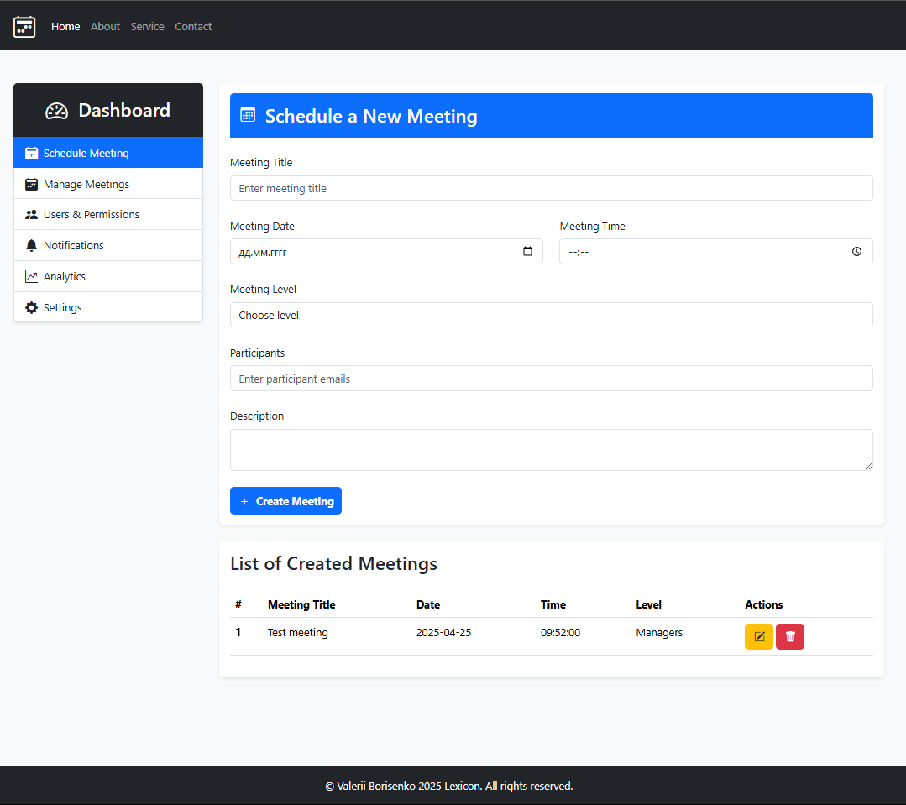

# [Meeting Calendar App React + Vite](https://valeriiborisenko.github.io/meeting-calendar-react-vite/)

**Task:** Build a Meeting Calendar Component with ReactJS.

**Objective:** The objective is to create a Meeting Calendar Component with all the necessary functionalities in the Schedule Meeting component. This includes form validation, managing user data. Follow React best practices to ensure the solution is modular, reusable, scalable, and professional.

